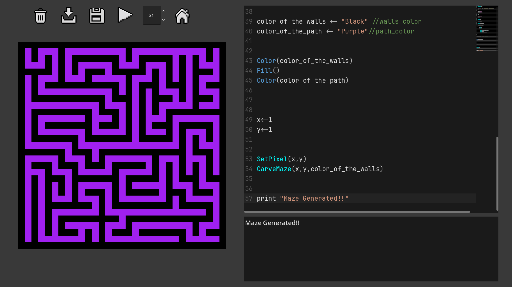
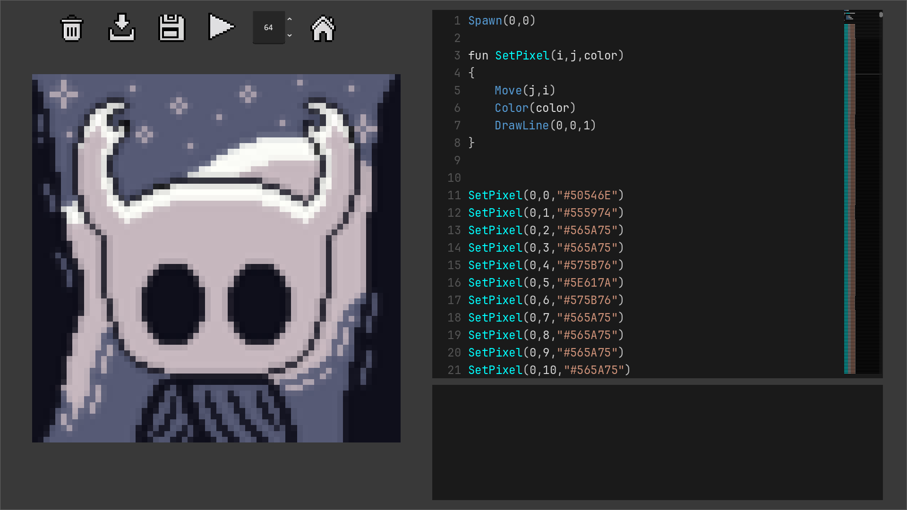
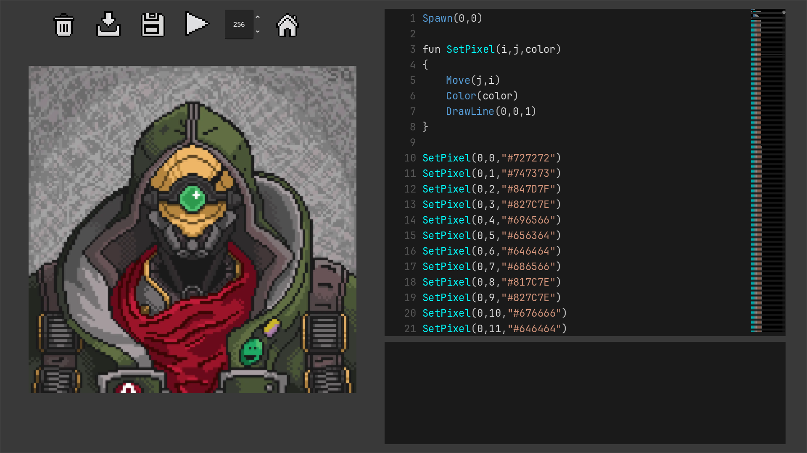

  
  <h1 align="center">Pixel Wall‑E</h1>

     
  

---

## 📜 Acerca del Proyecto

Pixel Wall‑E es un **editor de código** hecho en C# / Godot que interpreta un mini‑lenguaje de comandos para pintar pixel‑art en un canvas.  
Más allá de las instrucciones básicas de dibujo, soporta variables, asignaciones, estructuras de control y hasta declaracion de funciones.

---

## 📑 Tabla de Contenidos

- [🎯 Características Principales](#-características-principales)
- [📷 Capturas de pantalla](#-capturas-de-pantalla)    
- [🖌️ Comandos del Lenguaje](#️-comandos-del-lenguaje)  
- [🔧 Estructuras y Funciones](#-estructuras-y-funciones)
- [🏗️ Arquitectura del Proyecto](#️-arquitectura-del-proyecto)  
- [🧰 Tecnologías](#-tecnologías)  
- [🚀 Cómo Empezar](#-cómo-empezar)  
- [🤖 Convertidor de imagen](#-convertidor-de-imagen)  
- [🤝 Contribuciones](#-contribuciones)  
- [🔑 Licencia](#-licencia)  

---

## 🎯 Características Principales

- **Editor de Texto** con números de línea y resaltado de sintaxis  
- **Canvas cuadrado** dinámico: redimensionable y pintable  
- **Carga / Guarda** de archivos `.pw`
- **Interpretación** en tiempo real de código con manejo de errores (sintácticos, semánticos y de ejecución)  
- **Comentarios** en línea (`// comentario`)  y en bloque (`/* comentario */`)
- **Control de flujo**: `if…else`, `while`, `for`, etiquetas y `GoTo` condicional  
- **Declaración de funciones** con ámbitos sólidos y soporte a **recursión**  
- **Sistema de expresiones** aritméticas y booleanas, literales, variables y llamadas
---

## 📷 Capturas de pantalla

- ### **Laberinto** generado con un algoritmo recursivo en el lenguaje pw  

- ### **Pixel-Art** usando el Convertidor de Imagen

---

## 🖌️ Comandos del Lenguaje

1. **Spawn(int x, int y)**  
   Inicializa a Wall‑E en `(x,y)` sobre el canvas .

2. **Color(string color)**  
   Cambia el color del “pincel” entre: `Red`, `Blue`, `Green`, `Yellow`, `Orange`, `Purple`, `Black`, `White`, `Transparent` .

3. **Size(int k)**  
   Ajusta el grosor de la brocha a `k` píxeles (redondea hacia abajo al impar más cercano).

4. **DrawLine(int dirX, int dirY, int distance)**  
   Traza una línea en una de las 8 direcciones (combinaciones de -1,0,1) y mueve a Wall‑E al final .

5. **DrawCircle(int dirX, int dirY, int radius)**  
   Dibuja la circunferencia de un círculo de radio `radius` en la dirección `(dirX,dirY)`.

6. **DrawRectangle(int dirX, int dirY, int distance, int width, int height)**  
   Dibuja los bordes de un rectángulo centrado a distancia `distance` en la dirección dada.

7. **Fill()**  
   Relleno “bucket” basado en flood‑fill desde la posición actual .

---

## 🔧 Estructuras y Funciones

- **Asignaciones**: `var ← Expression`  
- **Expresiones aritméticas**: `+`, `-`, `*`, `/`, `**`, `%`  
- **Expresiones booleanas**: comparaciones (`==`, `>`, `<`, etc.), `&&`, `||`  
- **Variables** numéricas, booleanas y string
- **Funciones internas**:
  - `rand(int minRange, int maxRange)`
  - `GetColor(int x, int y)`
  - `GetActualX()`, `GetActualY()`
  - `GetCanvasSize()`
  - `GetColorCount(string color, int x1, int y1, int x2, int y2)`
  - `IsBrushColor(string color)`
  - `IsBrushSize(int size)`
  - `IsCanvasColor(string color, int vertical, int horizontal)` 
  - `Move(int x, int y)`
- **Comentarios**
  - de línea (`// …`)  
  -  de bloque (`/* …  */`)  
- **Control de flujo**:
  - `if (condition) { … } else { … }`
  - `while (condition) { … }`
  - `for (init; condition; update) { … }`
  - **Etiquetas** y `GoTo [label] (condition)`
- **Declaración de funciones**:
  - `fun Function (parameters) { … }`

## 🏗️ Arquitectura del Proyecto

1. **UI**  
   - **Editor de Texto** con resaltado y validación en tiempo de edición  
   - **Canvas** interactivo  
   - Panel de **controles**: tamaño de canvas, botones `Resize`, `Run`, `Load`, `Save` y `Delete`

2. **Parser & AST**  
   - Análisis léxico y sintáctico  
   - Generación de AST y chequeos semánticos

3. **Intérprete**  
   - Ejecución secuencial de instrucciones  
   - Manejo de scopes  
   - Captura y reporte de errores

4. **Extensibilidad**  
   - Extensible para añadir nuevas instrucciones, funciones o expresiones sin modificar el core

---

## 🧰 Tecnologías

- **Godot Engine** / C# para UI 
- **Aseprite** para assets de pixel‑art  
- **GitHub** para control de versiones

---

## 🚀 Cómo Empezar

- **Para usar el editor de codigo**
1. Descargar ultimo release  
2. Descomprime y ejecuta el .exe   

- **Para ver el proyecto**
1. Clonar repositorio  
2. Restaurar dependencias
3. Ejecutar en Godot 
4. Uso
   - Define tu canvas y escribe código en el editor  
   - Presiona **Run** para ver el resultado en el canvas  
   - Carga/guarda scripts con extensión `.pw`

---

## 🤖 Convertidor de imagen

- **Para usar el Convertidor de Imagen**
1. Copiar tu imagen a la carpeta ImageConverter  
2. En el archivo ImageConverter.py poner el nombre de tu imagen y el nombre del archivo que quieres generar

---

## 🤝 Contribuciones

1. Haz un _fork_ del proyecto  
2. Crea una rama: `git checkout -b feature/my-feature`  
3. Commit: `git commit -m "Add feature"`  
4. Push: `git push origin feature/my-feature`  
5. Abre un _pull request_

---

## 🔑 Licencia

Distribuido bajo licencia **MIT**.

---  

👾 ¡Disfruta creando pixel‑art con este lenguaje y comparte tus creaciones! 👾

Un proyecto creado por <a href="https://github.com/jotaBello">@jotaBello</a>